# LAPORAN PRAKTIKUM TEKNOLOGI BASIS DATA PER-1

# LATIHAN 1

pada praktik ini kita akan menginstall mariaDB,sebelumnya kita siapkan software untuk diinstall,lalu klik next saat menginstall sampai pada bagian user settings,lalu pada users settings kita disuruh memasukkan password yang akan kita kehendaki,kemudian klik next lagi,sampai finish

# LISTING latihan 1
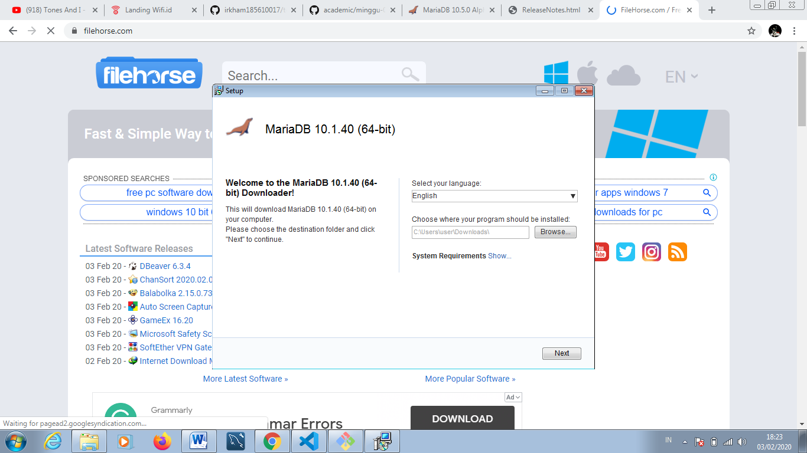  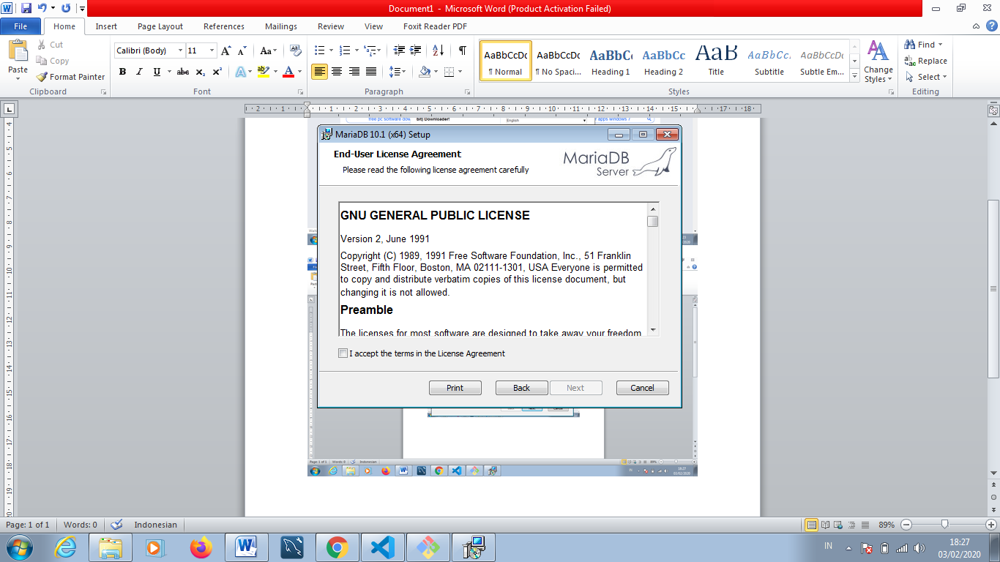 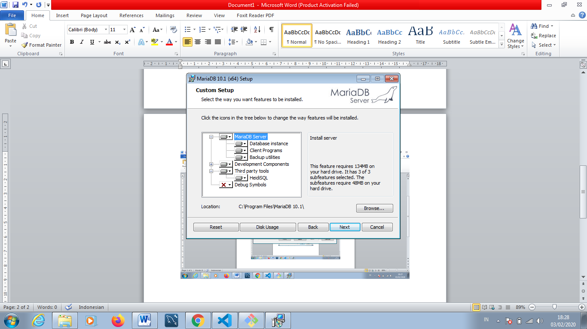 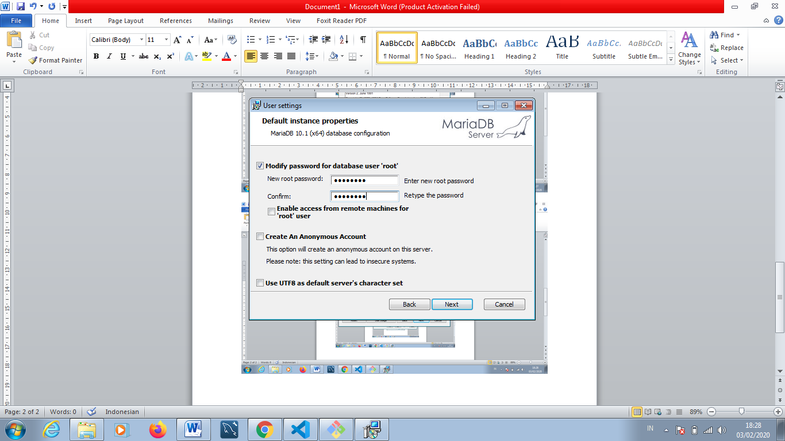 
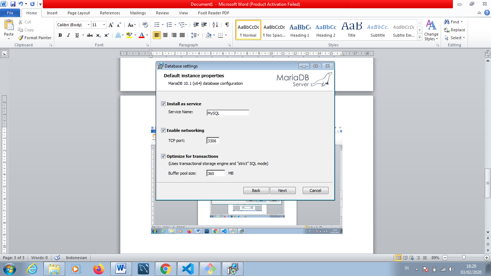 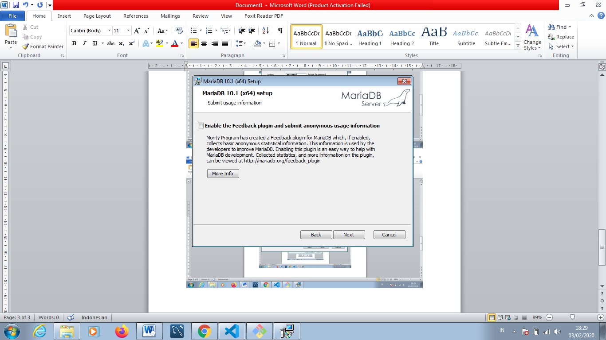 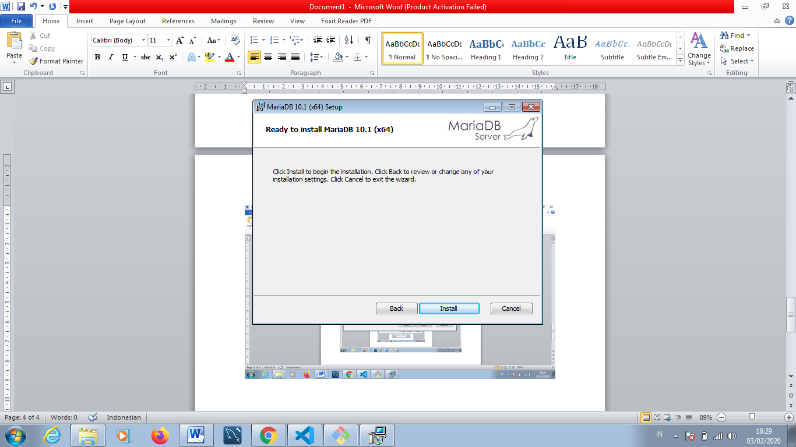 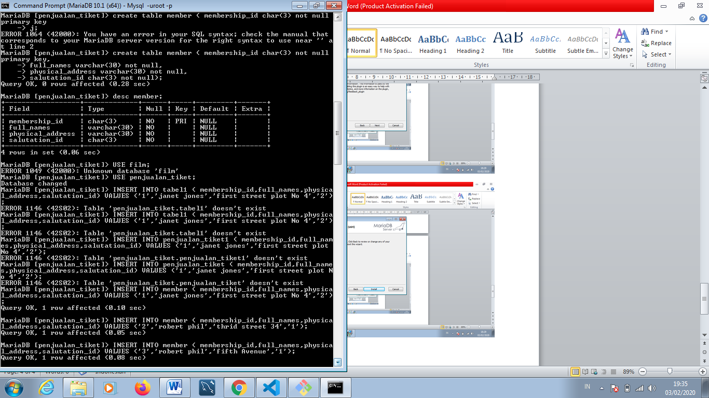 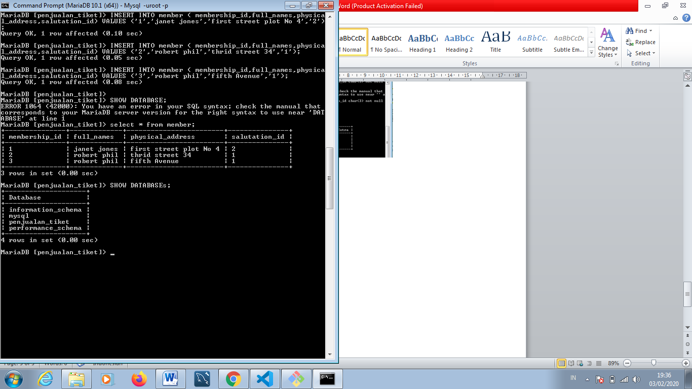
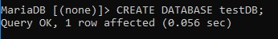 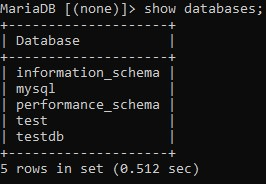 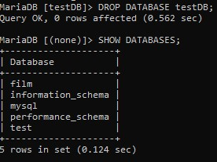 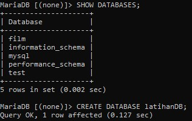 
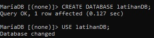 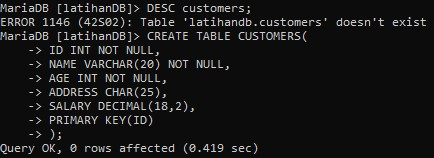 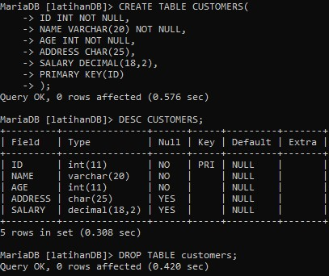 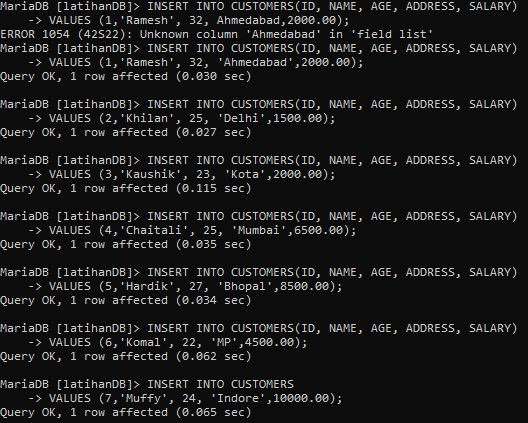 
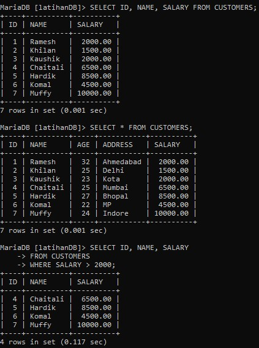 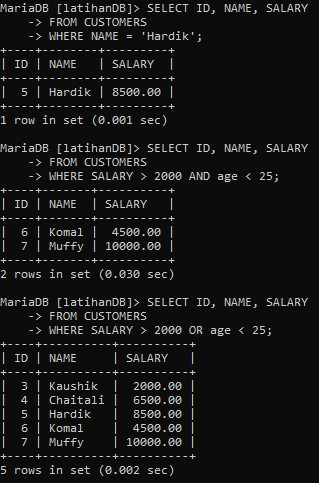 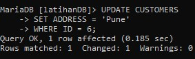 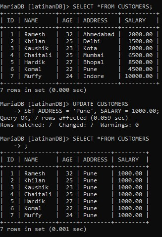
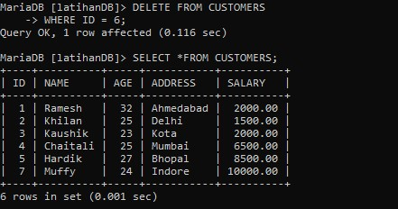 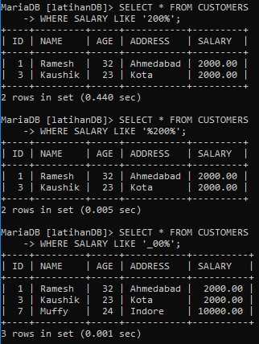  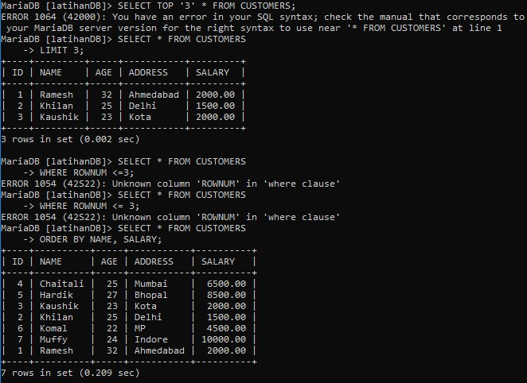
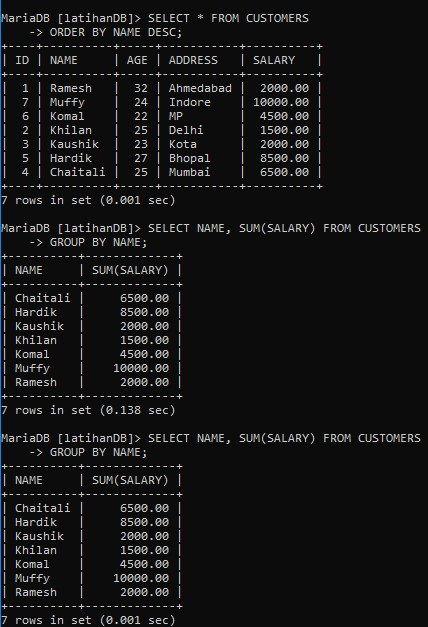 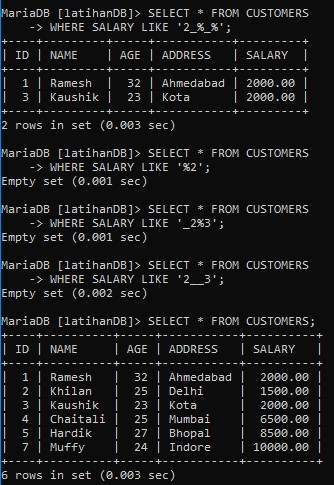 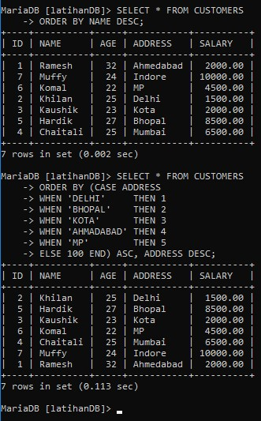 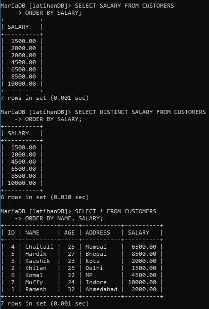

# PEMBAHASAN
# CREATE DATABASE

Jika Anda ingin membuat database baru <testDB>, maka pernyataan CREATE DATABASE.

# Show

Untuk melihat database.

# SQL DROP DATABASE 

Pernyataan SQL DROP DATABASE digunakan untuk menjatuhkan database yang ada dalam skema SQL. Hati-hati sebelum menggunakan operasi ini karena dengan menghapus basis data yang ada akan mengakibatkan hilangnya informasi lengkap yang disimpan dalam basis data.

# Show dan membuat database

Untuk melihat database dan juga akan membuat databse baru.

# USE

Ketika Anda memiliki banyak basis data dalam Skema SQL Anda, maka sebelum memulai operasi Anda, Anda perlu memilih basis data di mana semua operasi akan dilakukan. Pernyataan SQL USE digunakan untuk memilih basis data yang ada dalam skema SQL.

# DROP dan Create table 
 
Pernyataan SQL DROP TABLE digunakan untuk menghapus definisi tabel dan semua data, indeks, pemicu, batasan, dan spesifikasi izin untuk tabel itu. Anda harus sangat berhati-hati saat menggunakan perintah ini karena sekali tabel dihapus maka semua informasi yang tersedia di tabel itu juga akan hilang selamanya. CREATE TABLE adalah kata kunci yang memberitahu sistem basis data apa yang ingin Anda lakukan. Dalam hal ini, Anda ingin membuat tabel baru. Nama atau pengidentifikasi unik untuk tabel mengikuti pernyataan CREATE TABLE. Blok kode berikut adalah contoh, yang membuat tabel PELANGGAN dengan ID sebagai kunci utama dan BUKAN NULL adalah kendala yang menunjukkan bahwa bidang ini tidak dapat NULL saat membuat catatan dalam tabel ini.

# Insert query
 
Pernyataan SQL INSERT INTO digunakan untuk menambahkan baris data baru ke tabel di database. Anda mungkin tidak perlu menentukan nama kolom dalam kueri SQL jika Anda menambahkan nilai untuk semua kolom tabel. Tapi pastikan urutan nilainya dalam urutan yang sama dengan kolom dalam tabel.

# Select query

Pernyataan SQL SELECT digunakan untuk mengambil data dari tabel database yang mengembalikan data ini dalam bentuk tabel hasil. Tabel hasil ini disebut set hasil. Kode berikut adalah contoh, yang akan mengambil bidang ID, Nama, dan Gaji pelanggan yang tersedia di tabel PELANGGAN. Jika Anda ingin mengambil semua bidang tabel PELANGGAN, maka Anda harus menggunakan kueri berikut.

# Where clause

Klausa SQL WHERE digunakan untuk menentukan kondisi saat mengambil data dari satu tabel atau dengan bergabung dengan beberapa tabel. Jika kondisi yang diberikan terpenuhi, maka hanya mengembalikan nilai tertentu dari tabel. Anda harus menggunakan klausa WHERE untuk memfilter catatan dan hanya mengambil catatan yang diperlukan. Kode berikut adalah contoh yang akan mengambil bidang ID, Nama dan Gaji dari tabel PELANGGAN, di mana gaji lebih besar dari 2000. Kueri berikut adalah contoh, yang akan mengambil bidang ID, Nama dan Gaji dari tabel PELANGGAN untuk pelanggan dengan nama Hardik.

# Update Query

SQL UPDATE Query digunakan untuk mengubah catatan yang ada dalam sebuah tabel. Anda bisa menggunakan klausa WHERE dengan kueri UPDATE untuk memperbarui baris yang dipilih, jika tidak semua baris akan terpengaruh. Kueri berikut akan memperbarui ADDRESS untuk pelanggan yang nomor IDnya 6 dalam tabel.

# Update Query

Jika Anda ingin mengubah semua nilai ALAMAT dan gaji pada tabel PELANGGAN, Anda tidak perlu menggunakan klausa WHERE karena kueri UPDATE akan cukup seperti yang ditunjukkan pada blok kode berikut.

# Delete Query

SQL DELETE Query digunakan untuk menghapus catatan yang ada dari sebuah tabel. Anda dapat menggunakan klausa WHERE dengan permintaan DELETE untuk menghapus baris yang dipilih, jika tidak semua catatan akan dihapus. Kode berikut memiliki kueri, yang akan HAPUS pelanggan, yang ID-nya adalah 6.

# Like Clause
   
Klausa LIKE LIKE digunakan untuk membandingkan nilai ke nilai yang sama menggunakan operator wildcard. Ada dua wildcard yang digunakan bersama dengan operator LIKE. Tanda persen (%) , Garis bawah (_) . Tanda persen mewakili nol, satu atau beberapa karakter. Garis bawah mewakili satu angka atau karakter. Simbol-simbol ini dapat digunakan dalam kombinasi.
Berikut ini adalah contoh, yang akan menampilkan semua catatan dari tabel PELANGGAN, di mana GAJI dimulai dengan 200.

# Top Clause

Klausa SQL TOP digunakan untuk mengambil nomor N TOP atau catatan X persen dari tabel. Semua database tidak mendukung klausa TOP. Sebagai contoh, MySQL mendukung klausa LIMIT untuk mengambil catatan dalam jumlah terbatas sementara Oracle menggunakan perintah ROWNUM untuk mengambil catatan dalam jumlah terbatas. Kueri berikut adalah contoh pada server SQL, yang akan mengambil 3 catatan teratas dari tabel PELANGGAN. Jika Anda menggunakan server MySQL, maka ini adalah contoh yang setara. Jika Anda menggunakan server Oracle, maka blok kode berikut memiliki contoh yang setara.

# Order By

SQL SQL ORDER BY clause digunakan untuk mengurutkan data dalam urutan naik atau turun, berdasarkan pada satu atau beberapa kolom. Beberapa database mengurutkan hasil permintaan dalam urutan naik secara default. Blok kode berikut memiliki contoh, yang akan mengurutkan hasilnya dalam urutan naik oleh NAMA dan Gaji.

# GROUP BY
 
Klausa SQL GROUP BY digunakan bersama dengan pernyataan SELECT untuk mengatur data yang identik ke dalam kelompok. Klausa GROUP BY ini mengikuti klausa WHERE dalam pernyataan SELECT dan mendahului klausa ORDER BY.

# Sorting Results
 
Klausa SQL ORDER BY digunakan untuk mengurutkan data dalam urutan naik atau turun, berdasarkan pada satu atau beberapa kolom. Beberapa database mengurutkan hasil permintaan dalam urutan naik secara default.

