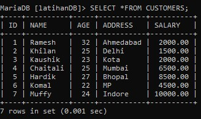

# LAPORAN PRAKTIKUM TEKNOLOGI BASIS DATA PER-1

# LATIHAN 1

pada praktik ini kita akan menginstall mariaDB,sebelumnya kita siapkan software untuk diinstall,lalu klik next saat menginstall sampai pada bagian user settings,lalu pada users settings kita disuruh memasukkan password yang akan kita kehendaki,kemudian klik next lagi,sampai finish

# LISTING latihan 1
     
    
    
    
   
   
   

