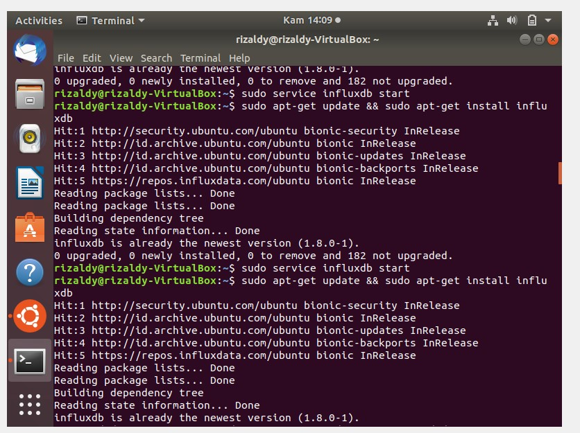

# LAPORAN PRAKTIKUM TEKNOLOGI BASIS DATA PER-10

# LISTING latihan
     
    
    

# PEMBAHASAN
# Instalasi InfluxDB
     

Disini cara untuk melakukan instalasi influxDB menggunakan ubuntu.

# Membuat DataBase

Menjalankan influx akan memulai CLI dan secara otomatis terhubung ke instance InfluxDB lokal (dengan asumsi Anda telah memulai server dengan start layanan influxdb atau dengan menjalankan influxd secara langsung).

Instalasi baru InfluxDB tidak memiliki basis data (terlepas dari sistem _internal), jadi membuatnya adalah tugas pertama kami. Anda dapat membuat database dengan pernyataan CREATE DATABASE <db-name> InfluxQL, di mana <db-name> adalah nama database yang ingin Anda buat. Nama-nama basis data dapat berisi karakter unicode apa pun selama string tersebut dikutip ganda. Nama juga dapat dibiarkan tanda kutip jika hanya berisi huruf, digit, atau garis bawah ASCII dan tidak dimulai dengan angka.

Sekarang setelah database mydb dibuat, SHOW DATABASES untuk menampilkan semua database .

Tidak seperti SHOW DATABASES, sebagian besar pernyataan InfluxQL harus beroperasi terhadap basis data tertentu. Anda dapat secara eksplisit memberi nama database dengan setiap permintaan, tetapi CLI memberikan pernyataan kenyamanan, USE <db-name>, yang secara otomatis akan mengatur database untuk semua permintaan yang akan dibuat.

# Menulis dan menjelajahi data

Untuk memasukkan titik data seri waktu tunggal ke dalam InfluxDB menggunakan CLI, masukkan INSERT diikuti oleh titik.

Suatu titik dengan nama pengukuran host dan wilayah cpu dan tag kini telah ditulis ke basis data, dengan nilai terukur 0,64.

Mari kita coba menyimpan tipe data lain, dengan dua bidang dalam pengukuran yang sama.

Untuk mengembalikan semua bidang dan tag dengan kueri, Anda dapat menggunakan operator *.

InfluxQL memiliki banyak fitur dan kata kunci yang tidak tercakup di sini, termasuk dukungan untuk Go-style regex.
Menggunakan * tanpa klausa LIMIT pada database besar dapat menyebabkan masalah kinerja. Anda dapat menggunakan Ctrl + C untuk membatalkan permintaan yang terlalu lama untuk merespons.

# TUGAS

