# LAPORAN PRAKTIKUM TEKNOLOGI BASIS DATA PER-2

# LISTING latihan
Getting 
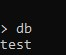 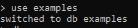 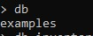 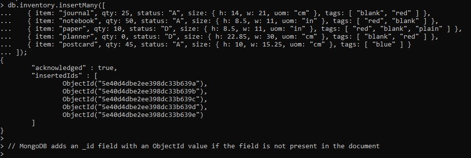 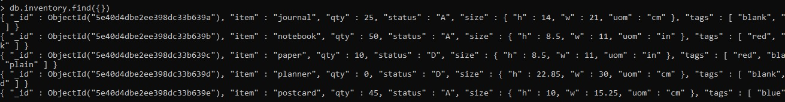 
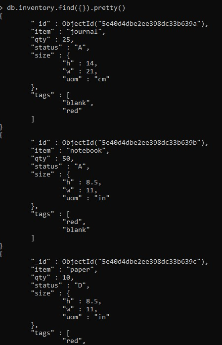 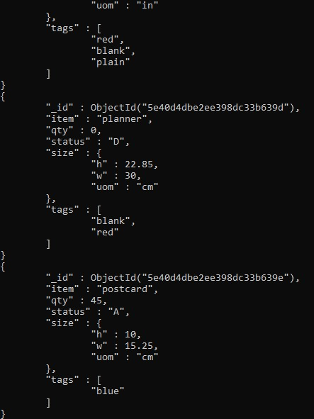 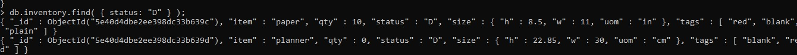  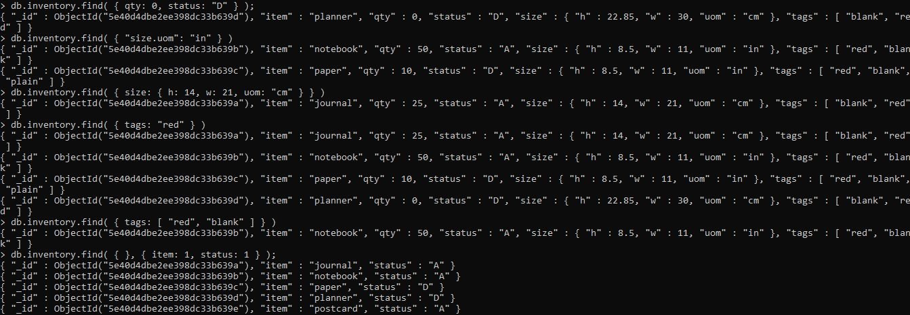
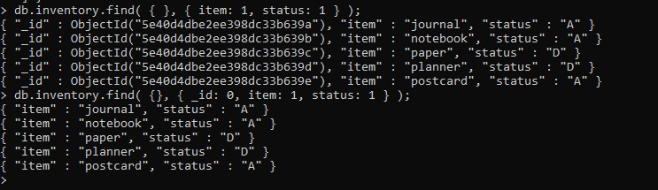

Crud
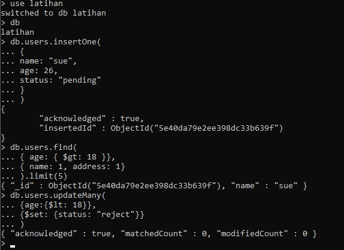 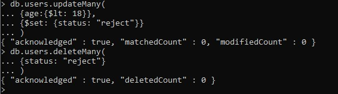

# PEMBAHASAN
Gambar_1 Gambar_2 Gambar_3
Di dalam shell, db merujuk ke database Anda saat ini. Ketik db untuk menampilkan basis data saat ini.
Operasi harus mengembalikan tes, yang merupakan basis data default.Untuk berpindah database, ketik gunakan <db>. Misalnya, untuk beralih ke database.Anda tidak perlu membuat database sebelum beralih. MongoDB membuat database ketika Anda pertama kali menyimpan data dalam database itu (seperti membuat koleksi pertama dalam database).

Gambar_4
MongoDB menyimpan dokumen dalam koleksi. Koleksi dianalogikan dengan tabel dalam database relasional. Jika koleksi tidak ada, MongoDB membuat koleksi ketika Anda pertama kali menyimpan data untuk koleksi itu.Contoh berikut menggunakan metode db.collection.insertMany () untuk menyisipkan dokumen baru ke dalam koleksi inventaris. Anda dapat menyalin dan menempelkan contoh ke shell di atas. Operasi mengembalikan dokumen yang berisi indikator pengakuan dan array yang berisi _id dari setiap dokumen yang berhasil dimasukkan.

Gambar_5 Gambar_6a 6b
Untuk memilih dokumen dari koleksi, Anda dapat menggunakan metode db.collection.find (). Untuk memilih semua dokumen dalam koleksi, berikan dokumen kosong sebagai dokumen filter kueri ke metode. Dalam shell, salin dan tempel yang berikut untuk mengembalikan semua dokumen dalam koleksi inventaris.

Gambar_7 Gambar_8  Gambar_9
Dalam shell, salin dan tempel yang berikut untuk mengembalikan dokumen yang bidang isinya sama dengan "D":
Dalam shell, salin dan tempel berikut ini untuk mengembalikan dokumen dengan bidang qty sama dengan 0:
Dalam shell, salin dan tempel berikut ini untuk mengembalikan dokumen dengan bidang qty sama dengan 0 dan bidang status sama dengan "D":
Dalam shell, salin dan tempel berikut ini untuk mengembalikan dokumen tempat bidang uom, bersarang di dalam dokumen ukuran, sama dengan "in":
Dalam shell, salin dan tempel berikut ini untuk mengembalikan dokumen yang bidang isinya sama dengan dokumen {h: 14, w: 21, uom: "cm"}:
Kecocokan kesetaraan pada dokumen yang disematkan membutuhkan kecocokan yang tepat, termasuk urutan bidang.
Dalam shell, salin dan tempel yang berikut untuk mengembalikan dokumen tempat array tag berisi "merah" sebagai salah satu elemennya
Jika bidang tag adalah string dan bukan array, maka kueri hanyalah kecocokan kesetaraan.
Di dalam shell, salin dan tempel yang berikut untuk mengembalikan dokumen tempat bidang tag cocok dengan array yang ditentukan.

Gambar_10
Untuk menentukan bidang yang akan dikembalikan, kirimkan dokumen proyeksi ke metode db.collection.find (<dokumen permintaan>, <dokumen proyeksi>). Dalam dokumen proyeksi, tentukan:

     <field>: 1 untuk memasukkan bidang dalam dokumen yang dikembalikan
     <field>: 0 untuk mengecualikan bidang dalam dokumen yang dikembalikan

Dalam shell, salin dan tempel yang berikut untuk mengembalikan _id, item, dan bidang status dari semua dokumen dalam koleksi inventaris:
Anda tidak harus menentukan bidang _id untuk mengembalikan bidang. Ini kembali secara default. Untuk mengecualikan bidang, atur ke 0 dalam dokumen proyeksi. Misalnya, salin dan tempel yang berikut untuk hanya mengembalikan item, dan bidang status dalam dokumen yang sesuai.

Gambar_11 Gambar_12
create operations
Buat atau masukkan operasi, tambahkan dokumen baru ke koleksi. Jika koleksi saat ini tidak ada, operasi memasukkan akan membuat koleksi.
Di MongoDB, masukkan target operasi satu koleksi. Semua operasi penulisan di MongoDB adalah atom pada tingkat satu dokumen.

read operations
Operasi baca mengambil dokumen dari koleksi; mis. meminta koleksi untuk dokumen. MongoDB menyediakan metode berikut untuk membaca dokumen dari koleksi.

update operations
Perbarui operasi memodifikasi dokumen yang ada dalam koleksi. MongoDB menyediakan metode berikut untuk memperbarui dokumen koleksi
Di MongoDB, perbarui operasi menargetkan satu koleksi. Semua operasi penulisan di MongoDB adalah atom pada tingkat satu dokumen.
Anda dapat menentukan kriteria, atau filter, yang mengidentifikasi dokumen yang akan diperbarui. Filter ini menggunakan sintaks yang sama dengan operasi baca.

