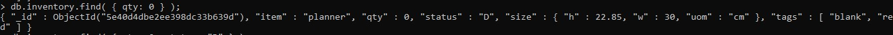

# LAPORAN PRAKTIKUM TEKNOLOGI BASIS DATA PER-2

# LISTING latihan
Getting 
     
    

Crud
 

# PEMBAHASAN
Gambar_1
Di dalam shell, db merujuk ke database Anda saat ini. Ketik db untuk menampilkan basis data saat ini.
Operasi harus mengembalikan tes, yang merupakan basis data default.Untuk berpindah database, ketik gunakan <db>. Misalnya, untuk beralih ke database.Anda tidak perlu membuat database sebelum beralih. MongoDB membuat database ketika Anda pertama kali menyimpan data dalam database itu (seperti membuat koleksi pertama dalam database).

