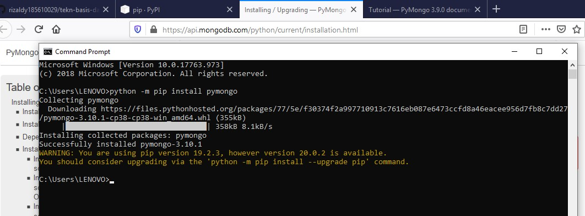
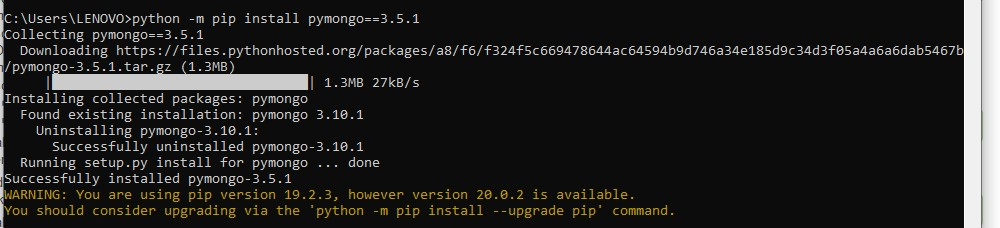
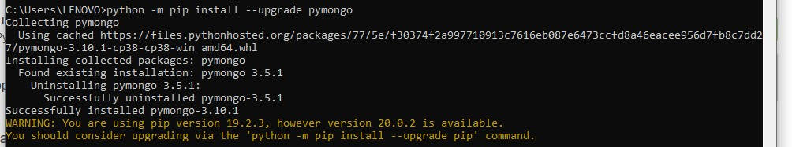
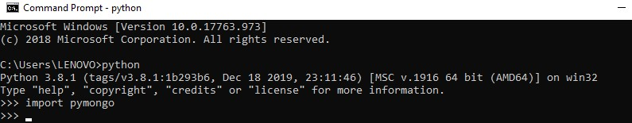
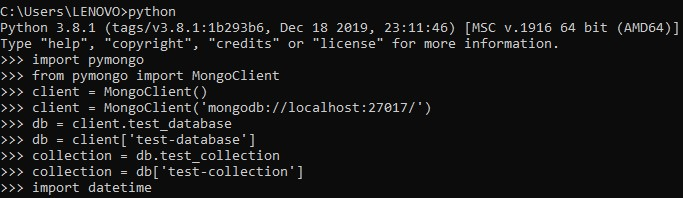
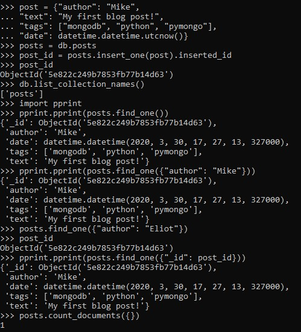
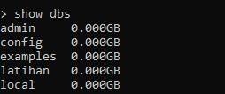

# LAPORAN PRAKTIKUM TEKNOLOGI BASIS DATA PER-3

# LISTING latihan
instalasi PyMongo
    
 

# PEMBAHASAN
# Gambar_1 Gambar_2 Gambar_3
Pada gambar tersebut dijelaskan cara instalasi PyMongo menggunakan driver mongodb untuk python

# Gambar_4
# Prasyarat
Sebelum kita mulai, pastikan Anda sudah menginstal distribusi PyMongo. Di kulit Python, berikut ini harus dijalankan tanpa memunculkan pengecualian

# Gambar_5
# Membuat Koneksi dengan MongoClient
Langkah pertama ketika bekerja dengan PyMongo adalah membuat MongoClient ke instance mongod yang sedang berjalan. Melakukannya itu mudah.Kode akan terhubung pada host dan port default lalu dapat menentukan host dan port secara eksplisit.

# Membuat Database
Jika nama database Anda sedemikian rupa sehingga menggunakan akses gaya atribut tidak akan berfungsi.

# Mendapatkan Koleksi
Catatan penting tentang koleksi (dan basis data) di MongoDB adalah bahwa mereka dibuat dengan malas - tidak ada perintah di atas yang benar-benar melakukan operasi apa pun di server MongoDB. Koleksi dan basis data dibuat saat dokumen pertama dimasukkan ke dalamnya.

# Gambar_6
# Dokumen
Data dalam MongoDB diwakili (dan disimpan) menggunakan dokumen gaya JSON. Di PyMongo kami menggunakan kamus untuk mewakili dokumen.
Perhatikan bahwa dokumen dapat berisi tipe Python asli (seperti instance datetime.datetime) yang akan secara otomatis dikonversi ke dan dari tipe BSON yang sesuai.

# Memasukkan Dokumen
Untuk menyisipkan dokumen ke dalam koleksi, kita dapat menggunakan metode insert_one ():

Ketika dokumen dimasukkan kunci khusus, "_id", secara otomatis ditambahkan jika dokumen tersebut belum mengandung kunci "_id". Nilai "_id" harus unik di seluruh koleksi. insert_one () mengembalikan sebuah instance dari InsertOneResult. Untuk informasi lebih lanjut tentang "_id", lihat dokumentasi di _id.

Setelah memasukkan dokumen pertama, koleksi tulisan sebenarnya telah dibuat di server. Kami dapat memverifikasi ini dengan mendaftar semua koleksi di basis data.

# Mendapatkan Dokumen Tunggal Dengan find_one ()
Jenis kueri paling dasar yang dapat dilakukan di MongoDB adalah find_one (). Metode ini mengembalikan satu dokumen yang cocok dengan kueri (atau Tidak Ada jika tidak ada yang cocok). Ini berguna ketika Anda tahu hanya ada satu dokumen yang cocok, atau hanya tertarik pada pertandingan pertama. Di sini kami menggunakan find_one () untuk mendapatkan dokumen pertama dari koleksi entri.

Catatan
Dokumen yang dikembalikan berisi "_id", yang secara otomatis ditambahkan pada sisipan.

find_one () juga mendukung permintaan pada elemen tertentu yang harus cocok dengan dokumen yang dihasilkan. Untuk membatasi hasil kami pada dokumen dengan penulis "Mike", kami melakukannya.

Jika kami mencoba dengan penulis lain, seperti "Eliot", kamu tidak akan mendapatkan hasil.

# Permintaan Dengan ObjectId

Tugas umum dalam aplikasi web adalah untuk mendapatkan ObjectId dari URL permintaan dan menemukan dokumen yang cocok. Dalam hal ini, perlu untuk mengubah ObjectId dari string sebelum meneruskannya ke find_one.

# Gambar_7
Gambar 7 Untuk melihat database.

