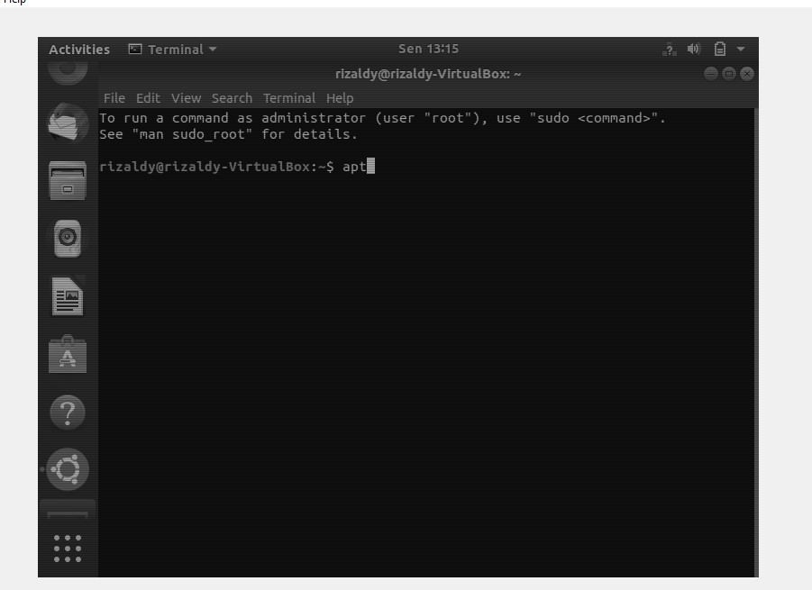
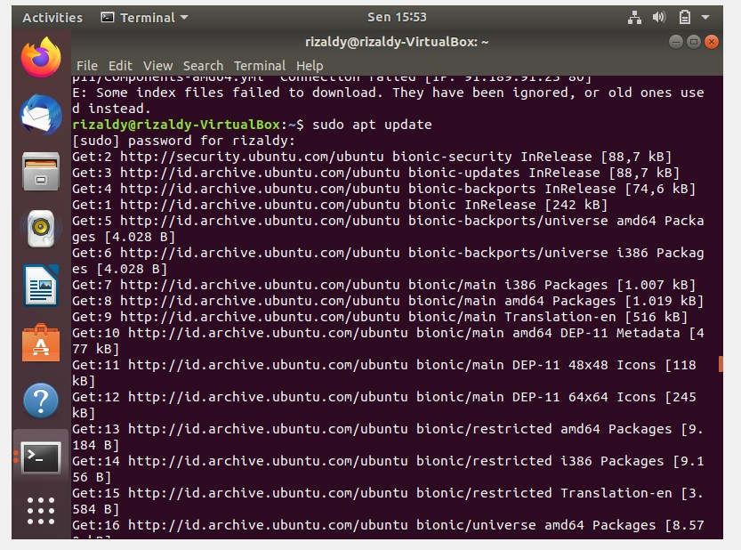

# LAPORAN PRAKTIKUM TEKNOLOGI BASIS DATA PER-4

# LISTING latihan
# instalasi ubuntu
     
 
# Latihan
   
  

# PEMBAHASAN
#  
# Tulis, Baca, Perbarui, dan Hapus Data dalam Redis
Tulis : Untuk menyimpan nilai dalam Redis, kita dapat menggunakan perintah SET yang seperti pada gambar yang diatas. Dalam bahasa Inggris, bunyinya seperti "set kunci untuk menyimpan nilai." Penting untuk dicatat bahwa jika kunci sudah memiliki nilai, SET akan menimpanya, apa pun yang terjadi.
Baca : Kita bisa menggunakan perintah GET untuk meminta Redis nilai kunci. Dalam API klasik yang terhubung ke database, kami ingin melakukan operasi CRUD: membuat, membaca, memperbarui, dan menghapus. Kami telah membahas cara membuat (menulis) dan membaca data dalam Redis dengan menggunakan perintah SET dan GET masing-masing. 
Perbarui : Kami dapat memperbarui nilai kunci hanya dengan menimpa datanya seperti yang disebutkan sebelumnya. Tapi, kami berubah pikiran dan sekarang kami ingin nilainya menjadi "bereaksi". Kita dapat menimpanya. Redis memang membalas dengan "bereaksi". Kami sedikit ragu-ragu dan sekarang kami ingin mengatur kunci kerangka kerja untuk mempertahankan nilai "vue": . Jika kita menjalankan kerangka kerja GET lagi, kita mendapat "vue". Pembaruan / menimpa berfungsi seperti yang diharapkan.
Hapus Data : Redis membalas dengan (integer) 1 untuk memberi tahu kami jumlah kunci yang dihapus. Dengan hanya tiga perintah, SET, GET, dan DEL, kami dapat mematuhi empat operasi CRUD .

# 
# Tombol Kedaluwarsa
Saat membuat kunci dengan Redis, kita dapat menentukan berapa lama kunci itu harus tetap tersimpan dalam memori. Dengan menggunakan perintah EXPIRE, kita dapat menetapkan batas waktu pada suatu tombol dan menghapus kunci secara otomatis setelah batas waktu berakhir. Ini menjadwalkan kunci notifikasi yang akan dihapus dalam 30 detik. Kami dapat melihat jam dan memeriksa setelah 30 detik telah berlalu jika pemberitahuan masih tersedia tetapi kami tidak harus melakukannya! Redis menawarkan perintah TTL yang memberi tahu kami berapa detik kunci yang tersisa sebelum habis masa berlakunya dan dihapus. Kami telah mempelajari sebelumnya bahwa menggunakan SET sama dengan membuat kunci lagi, yang untuk Redis juga melibatkan pengaturan ulang setiap timeout saat ini ditugaskan untuk itu. Kami memiliki dasar yang kuat sekarang tentang memanipulasi data di Redis. Dengan pengetahuan ini, kami siap untuk mengeksplorasi tipe data yang ditawarkan Redis.

# 
# Daftar
Daftar adalah urutan elemen yang dipesan. Misalnya, 1 2 4 5 6 90 19 3 adalah Daftar angka. Di Redis, penting untuk dicatat bahwa daftar diimplementasikan sebagai daftar tertaut. Ini memiliki beberapa implikasi penting mengenai kinerja. Adalah cepat untuk menambahkan elemen ke kepala dan ekor Daftar tetapi lebih lambat untuk mencari elemen dalam Daftar karena kita tidak memiliki akses terindeks ke elemen (seperti yang kita lakukan dalam array). Daftar dibuat dengan menggunakan perintah Redis yang mendorong data diikuti dengan nama kunci. Ada dua perintah yang bisa kita gunakan: RPUSH dan LPUSH. Jika kunci tidak ada, perintah ini akan mengembalikan daftar baru dengan argumen yang diteruskan sebagai elemen. Jika kunci sudah ada atau bukan Daftar, kesalahan akan dikembalikan.
RUSH

#  
# Set
Anggota tertentu yang sudah menjadi bagian dari Set diabaikan. Jika kunci tidak ada, Set baru dibuat dan anggota yang ditentukan khusus ditambahkan. Jika kunci sudah ada atau bukan Set, kesalahan akan dikembalikan. Dalam hal ini, pada setiap penambahan anggota Redis mengembalikan jumlah anggota yang ditambahkan dengan perintah SADD, bukan ukuran Set. Perintah pertama mengembalikan 3 ketika kami menambahkan tiga anggota unik ke Set. Perintah kedua mengembalikan 0 sebagai "bahasa Inggris" sudah menjadi anggota Set.
