# LAPORAN PRAKTIKUM TEKNOLOGI BASIS DATA PER-5

# LISTING latihan
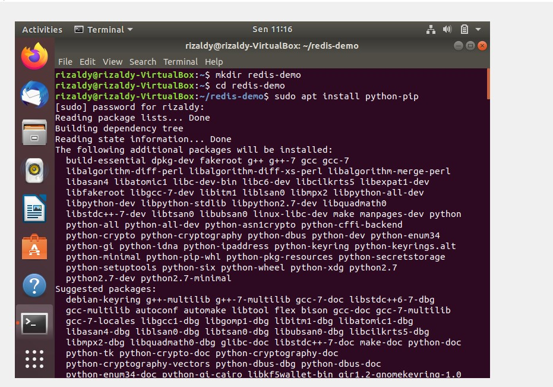 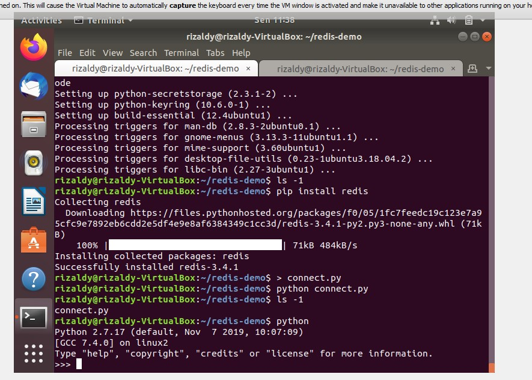 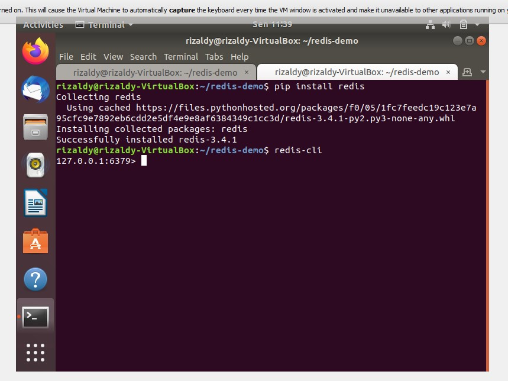 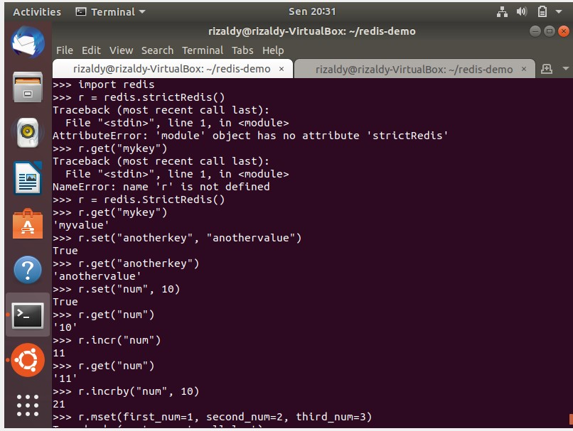 
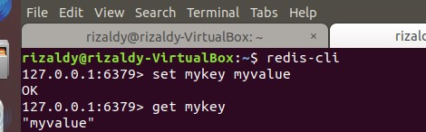 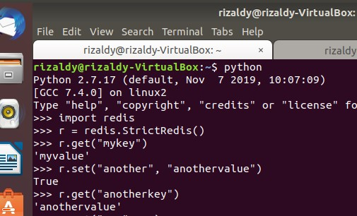 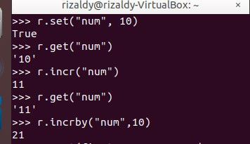 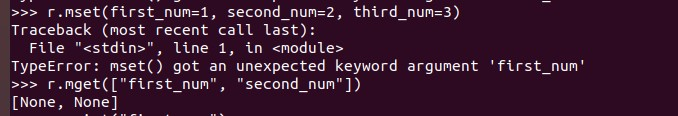 
    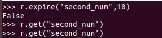
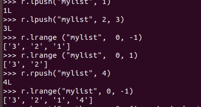  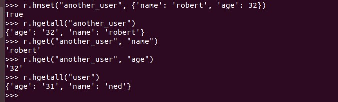 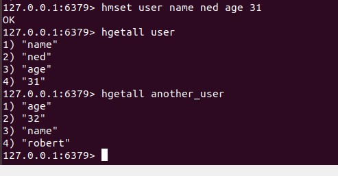 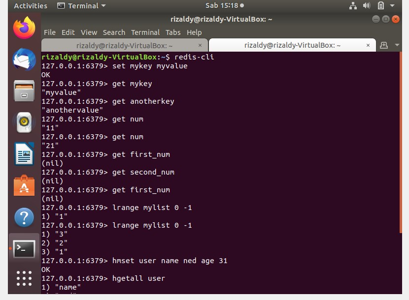

# PEMBAHASAN
# Instalasi Ubuntu Python
  
Cara melakukan Instalasi ubuntu python seperti gambar diatas

# Redis strings

untuk mengatur nilai string, kami menggunakan yang berikut dari redis-cli

Kami membuat instance dari StrictRedis. Ini diperlukan untuk komunikasi dengan redis-server. Coba dapatkan "mykey", yang diset menggunakan redis-cli, dari Python.Jadi kami dapat berkomunikasi dengan benar dengan redis-server. Hal-hal yang dimasukkan ke dalam redis menggunakan redis-cli dapat dibaca menggunakan Python.

# INCR and INCRBY

Redis menyediakan incr dan incrby pada nilai integer. Jadi, mari tetapkan nilai integer terlebih dahulu yang akan kami coba tambahkan.

# MSET and MGET
 
redis-cli setara dengan Python

# EXISTS

untuk mengeluarkan

# DEL
  
Untuk menghapus

# EXPIRE

Tandai kunci kedua untuk kedaluwarsa setelah 10 detik

# Redis Lists
 
Redis setara dengan Python . Melewati banyak nilai ke daftar. Periksa elemen yang didorong ke kanan.

# Redis hashes
 
hmset memungkinkan penyimpanan kamus sebagai nilai. Anda seharusnya sudah mengetahui ini dari redis docs.

