# LAPORAN PRAKTIKUM TEKNOLOGI BASIS DATA PER-8

# LISTING latihan
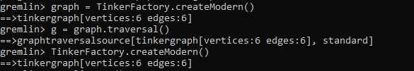 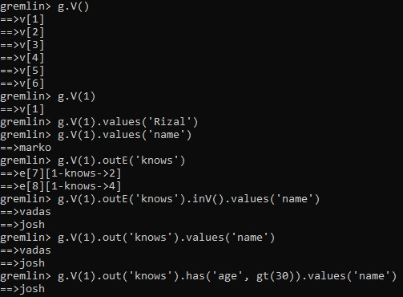  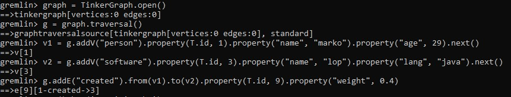 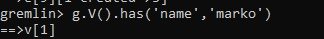 
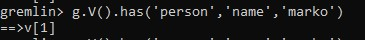 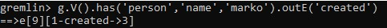 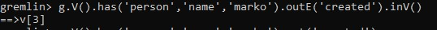 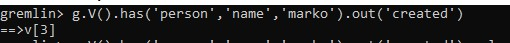 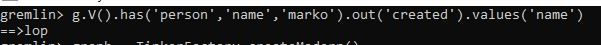
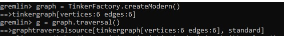 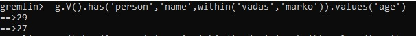 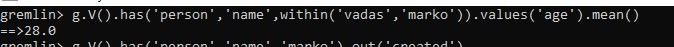 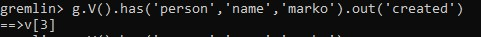 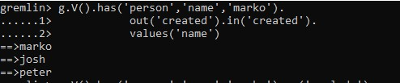
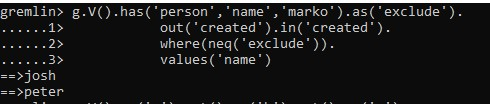 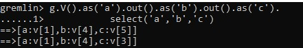 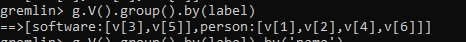 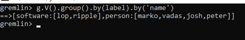 

# PEMBAHASAN
# Lima Menit Pertama

Perintah pertama membuat instance Graph bernama graph, yang dengan demikian menyediakan referensi ke data yang Anda inginkan untuk dilalui GREMLIN. Sayangnya, memiliki grafik tidak memberikan GREMLIN konteks yang cukup untuk melakukan pekerjaannya. Anda juga memerlukan sesuatu yang disebut TraversalSource, yang dihasilkan oleh perintah kedua. TraversalSource memberikan informasi tambahan kepada GREMLIN (seperti strategi traversal untuk diterapkan dan mesin traversal untuk digunakan) yang memberinya panduan tentang cara menjalankan perjalanannya di sekitar Grafik.
Ada beberapa cara untuk membuat TraversalSource. Contoh di atas menggunakan gaya tertanam dan merupakan pendekatan terbatas untuk bahasa menggunakan Java Virtual Machine (JVM). Metode lain serupa dalam bentuk, tetapi bukan fokus tutorial ini. Lihat Dokumentasi Referensi untuk informasi lebih lanjut tentang berbagai cara menghubungkan dengan GREMLIN.

Dapatkan semua simpul dalam Grafik. Dapatkan simpul dengan pengidentifikasi unik "1". Dapatkan nilai properti nama pada titik dengan pengidentifikasi unik "1". Dapatkan tepi dengan label "tahu" untuk titik dengan pengidentifikasi unik "1". Dapatkan nama-nama orang yang memiliki simpul dengan pengidentifikasi unik "1" "tahu". Perhatikan bahwa ketika seseorang menggunakan outE (). InV () seperti yang ditunjukkan pada perintah sebelumnya, ini dapat disingkat menjadi just out () (mirip dengan inE (). OutV () dan in () untuk tepi yang masuk). Dapatkan nama orang-orang vertex "1" tahu siapa yang berusia di atas 30.

# Lima belas Menit Selanjutnya

Seintuitif Anda, mungkin lebih intuitif bagi GREMLIN sendiri, karena simpul, tepi, dan properti merupakan elemen terpenting dari keberadaannya. Memang sangat membantu untuk memikirkan teman kita, GREMLIN, bergerak di sekitar grafik ketika mengembangkan traversal, seperti menggambarkan posisinya ketika traverser membantu mengarahkan ke mana Anda membutuhkannya untuk pergi selanjutnya. Mari kita gunakan grafik dua sudut.
Ada beberapa hal penting yang perlu diperhatikan dalam kode di atas. Pertama, ingat bahwa id "dicadangkan" untuk penggunaan khusus di TinkerPop. Ini adalah anggota enum, T. "Kunci" yang disediakan untuk metode pembuatan itu diimpor secara statis ke konsol, yang memungkinkan Anda untuk mengaksesnya tanpa harus menentukan enum sendiri. Anggap id sebagai bentuk steno yang memungkinkan gaya kode lebih lancar. Anda biasanya menyebutnya sebagai T.id.

Kedua, jangan lupa bahwa Anda bekerja dengan TinkerGraph, yang memungkinkan penugasan pengidentifikasi. Itu tidak terjadi pada kebanyakan basis data grafik. Akhirnya, label untuk Edge diperlukan dan karenanya merupakan bagian dari tanda tangan metode addEdge (). Penggunaan addEdge ini menciptakan sisi yang keluar dari v1 dan ke v2 dengan label "dibuat".

# Grafik Traversal - Tetap Sederhana

Bit GREMLIN ini dapat ditingkatkan dan dibuat lebih menyenangkan secara idiomatis dengan memasukkan label titik sebagai bagian dari filter untuk memastikan bahwa kunci properti "nama" mengacu pada titik "orang".

Kita dapat menggambarkan traversal ini dalam grafik kecil kita dengan GREMLIN yang duduk di dhuwur "1". Ketika GREMLIN berada di dhuwur atau tepi, ia memiliki akses ke semua properti yang tersedia untuk elemen itu. Sekarang GREMLIN telah menemukan "marko", dia dapat mempertimbangkan langkah berikutnya dalam traversal di mana kita memintanya untuk "berjalan" bersama "menciptakan" tepi ke simpul "perangkat lunak". Seperti yang dijelaskan sebelumnya, ujung memiliki arah, jadi kami harus memberi tahu GREMLIN arah mana yang harus diikuti. Dalam hal ini, kami ingin dia menelusuri tepi keluar dari titik "marko".

Pada titik ini, Anda dapat membayangkan GREMLIN bergerak dari titik "marko" ke tepi "dibuat".

Anda sekarang dapat menggambarkan GREMLIN pada vertex "perangkat lunak".

Karena Anda tidak meminta GREMLIN untuk melakukan apa pun dengan properti dari tepi "dibuat".

Akhirnya, sekarang GREMLIN telah mencapai "perangkat lunak yang dibuat Marko", ia memiliki akses ke properti dari vertex "perangkat lunak" dan oleh karena itu Anda dapat meminta GREMLIN untuk mengekstraksi nilai properti "nama".Anda sekarang seharusnya dapat melihat koneksi yang dimiliki GREMLIN ke struktur grafik dan bagaimana GREMLIN bermanuver dari simpul ke tepi dan sebagainya. Kemampuan Anda untuk merangkai langkah-langkah untuk meminta GREMLIN untuk melakukan hal-hal yang lebih kompleks tergantung pada pemahaman Anda tentang konsep-konsep dasar ini.

# Grafik Traversal - Meningkatkan Kompleksitas

Berbekal pengetahuan dari bagian sebelumnya, mari kita minta GREMLIN untuk melakukan beberapa tugas traversal yang lebih sulit. Tidak banyak yang dapat dilakukan dengan grafik "bayi" yang kami miliki, jadi mari kita kembali ke grafik mainan "modern" dari bagian "Lima Menit Pertama". Ingatlah bahwa Anda dapat membuat Grafik ini dan membuat TraversalSource.

Sebelumnya kami telah menggunakan has () - langkah untuk memberi tahu GREMLIN bagaimana menemukan titik "marko". Mari kita lihat beberapa cara lain untuk menggunakan has (). Bagaimana jika kita ingin GREMLIN menemukan nilai "usia" dari "vadas" dan "marko"? Dalam hal ini kita dapat menggunakan komparator dalam dengan has ().

Jika kita ingin bertanya kepada GREMLIN usia rata-rata "vadas" dan "marko" kita bisa menggunakan langkah mean () .

Metode penyaringan lainnya terlihat dalam penggunaan langkah di mana. Kami tahu cara menemukan "perangkat lunak" yang "marko".

Mari kita lanjutkan permintaan itu untuk mencoba mempelajari dengan siapa "marko" berkolaborasi dengan ketika datang ke perangkat lunak yang dibuatnya. Dengan kata lain, mari kita coba menjawab pertanyaan: "Dengan siapa orang-orang yang mengembangkan perangkat lunak?" Untuk melakukan itu, pertama-tama kita harus memotret GREMLIN di mana kita meninggalkannya dalam permintaan sebelumnya. Dia berdiri di puncak "perangkat lunak". Untuk mencari tahu siapa yang "menciptakan" "perangkat lunak" itu, kita harus memiliki GREMLIN melintasi kembali di sepanjang tepi "dibuat" untuk menemukan "orang" simpul terikat padanya.

Jadi itu bagus, kita dapat melihat bahwa "peter", "josh" dan "marko" semua bertanggung jawab untuk membuat "v [3]", yang merupakan simpul "perangkat lunak" bernama "lop". Tentu saja, kita sudah tahu tentang keterlibatan "marko" dan rasanya aneh untuk mengatakan bahwa "marko" berkolaborasi dengan dirinya sendiri, jadi mengecualikan "marko" dari hasil tampaknya logis. Traversal berikut menangani pengecualian.

Kami membuat dua tambahan pada traversal untuk membuatnya mengecualikan "marko" dari hasil. Pertama, kami menambahkan langkah as (). Langkah as () - sebenarnya bukan "langkah", tetapi "modulator langkah" - sesuatu yang menambahkan fitur ke langkah atau traversal. Di sini, as ('kecualikan') memberi label has () - langkah dengan nama "kecualikan" dan semua nilai yang melewati langkah itu disimpan dalam label itu untuk digunakan nanti. Dalam hal ini, simpul "marko" adalah satu-satunya simpul yang melewati titik itu, sehingga disimpan dalam "kecualikan".
Tambahan lain yang dibuat adalah langkah where () -, yang merupakan langkah filter seperti has (). Di mana () diposisikan setelah in () - langkah yang memiliki simpul "orang", yang berarti bahwa di mana () filter terjadi pada daftar kolaborator "marko". Di mana () menetapkan bahwa simpul "orang" yang melewatinya tidak boleh sama dengan (mis., Neq ()) isi dari label "kecualikan". Karena hanya berisi titik "marko", di mana () menyaring "marko" yang kita dapatkan ketika kita menelusuri kembali pada tepi "dibuat". Anda akan menemukan banyak kegunaan as (). Ini dia dikombinasikan dengan pilih.

Dalam contoh di atas, kami memberitahu GREMLIN untuk beralih melalui semua simpul dan melintasi dua kali dari masing-masing. GREMLIN masing-masing akan memberi label masing-masing simpul di jalur itu dengan "a", "b" dan "c". Kita kemudian dapat menggunakan pilih untuk mengekstraksi isi label itu. Langkah umum namun penting lainnya adalah grup () langkah dan modulator langkah terkait yang disebut oleh (). Jika kami ingin meminta GREMLIN untuk mengelompokkan semua simpul dalam grafik dengan label simpul mereka.

Penggunaan oleh () di sini menyediakan mekanisme untuk melakukan pengelompokan. Dalam hal ini, kami telah meminta GREMLIN untuk menggunakan label (yang, sekali lagi, merupakan impor statis otomatis dari T di konsol). Kami tidak dapat benar-benar memberi tahu banyak tentang distribusi kami karena kami hanya memiliki pengidentifikasi simpul yang unik sebagai output. Untuk membuatnya lebih bagus, kita bisa meminta GREMLIN untuk memberi kita nilai properti "nama" dari simpul-simpul itu, dengan memasok yang lain dengan () modulator ke grup () untuk mengubah nilai. Di bagian ini, Anda telah belajar sedikit lebih banyak tentang apa itu grafik properti dan bagaimana GREMLIN berinteraksi dengannya. Anda juga belajar cara membayangkan GREMLIN bergerak di sekitar grafik dan cara menggunakan beberapa langkah traversal yang lebih kompleks, tetapi umum digunakan. Anda sekarang siap untuk memikirkan TinkerPop dalam hal penerapannya yang lebih luas untuk komputasi grafik.

