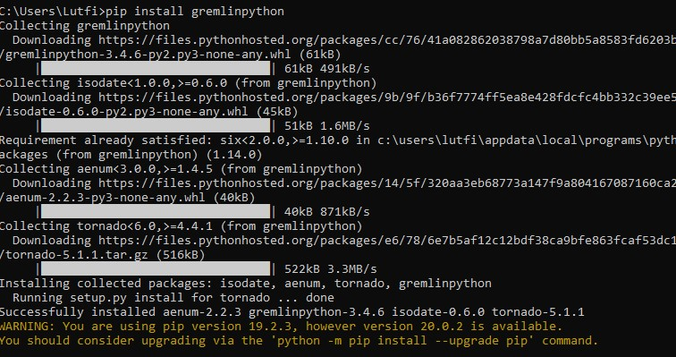
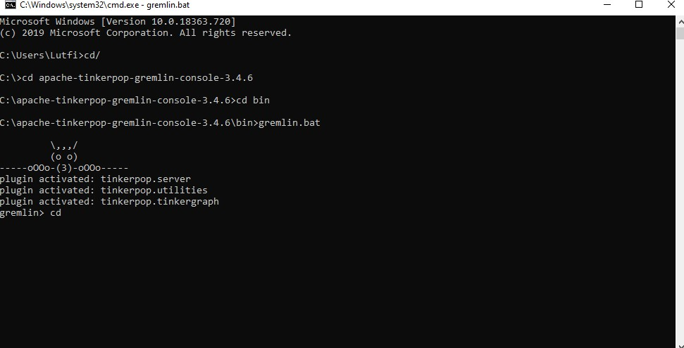
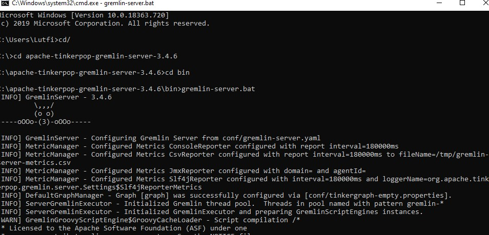
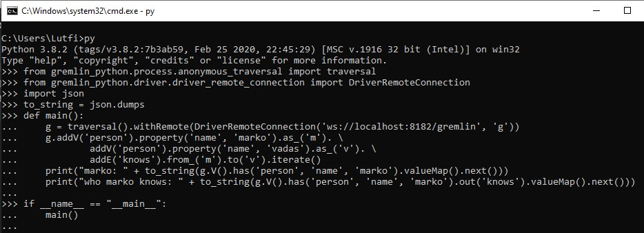
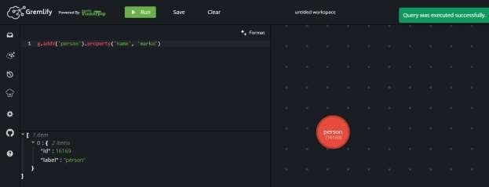
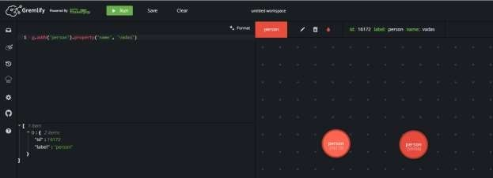

# LAPORAN PRAKTIKUM TEKNOLOGI BASIS DATA PER-9

# LISTING latihan
     

# PEMBAHASAN
# To install Gremlin-Python, use Python’s pip package manager

Apache TinkerPop's Gremlin-Python mengimplementasikan GREMLIN dalam bahasa Python dan dapat digunakan pada mesin virtual Python termasuk mesin CPython yang populer. Sintaksis Python memiliki konstruksi yang sama dengan Java termasuk "notasi titik" untuk fungsi chaining (abc), argumen fungsi braket bulat (a (b, c)), dan dukungan untuk ruang nama global (a (b ()) vs a (__. b ())). Dengan demikian, siapa pun yang akrab dengan GREMLIN-Java akan segera dapat bekerja dengan GREMLIN-Python. Selain itu, ada beberapa konstruksi tambahan untuk GREMLIN-Python yang membuat traversal sedikit lebih ringkas.

# Contoh Gremlin-Python

Pola untuk menghubungkan dijelaskan dalam Menghubungkan GREMLIN dan pada dasarnya menyaring untuk membuat GraphTraversalSource. GraphTraversalSource dibuat dari metode anonim traversal () di mana "g" yang disediakan untuk DriverRemoteConnection sesuai dengan nama GraphTraversalSource di ujung jarak jauh.

Untuk g.addV('person').property(... penjelasannya adalah tambahkan beberapa data - pastikan untuk menggunakan langkah terminasi seperti iterate () agar traversal."dieksekusi". iterate () tidak mengembalikan data apa pun dan digunakan hanya untuk menghasilkan efek samping.(mis. menulis data ke basis data).

Untuk print("marko: "... penjelasannya adalah mengambil data dari titik "marko".

Untuk print("who marko knows: " + to_string(g.... penjelasannya adalah temukan titik "marko" dan kemudian lintasi orang yang ia "kenal" dan kembalikan datanya.

# Tugas 
 

